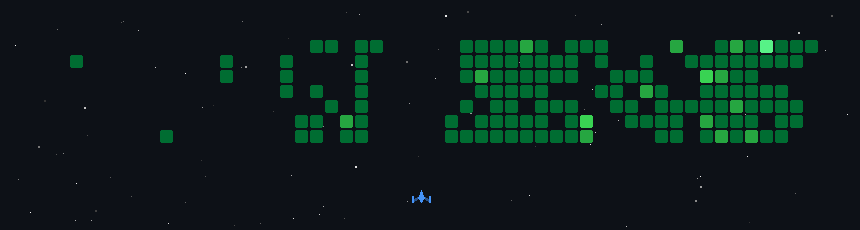

  

---

  <table>
    <tr>
      <td width="60%">
        🔭 I'm currently working on <strong>full-stack projects</strong> and exploring <strong>LLMs and OS development</strong>  
        🌱 Actively learning <strong>Data Structures & Algorithms</strong>, <strong>App Development</strong>, and <strong>LLM building</strong>  
        🌍 Based in: <strong>Mumbai, India</strong>  
        🔗 Portfolio: <a href="https://anexus-portfolio.vercel.app"><strong>anexus-portfolio.vercel.app</strong></a>  
        📫 Reach me at: <strong>anexus5919@gmail.com</strong>
      </td>
      <td align="right">
        
      </td>
    </tr>
  </table>

---

### 🌐 Connect with me

  &nbsp;&nbsp;
  &nbsp;&nbsp;
  &nbsp;&nbsp;
  

---

### 🛠️ Tech Stack

**Languages**

<table>
  <tr>
    <td></td>
    <td></td>
    <td></td>
    <td></td>
    <td></td>
    <td></td>
    <td></td>
  </tr>
</table>

**Frontend**

<table>
  <tr>
    <td></td>
    <td></td>
    <td></td>
    <td></td>
    <td></td>
    <td></td>
    <td></td>
    <td></td>
  </tr>
</table>

**Backend & Databases**

<table>
  <tr>
    <td></td>
    <td></td>
    <td></td>
    <td></td>
    <td></td>
    <td></td>
    <td></td>
    <td></td>
    <td></td>
    <td></td>
  </tr>
</table>

**AI / ML**

<table>
  <tr>
    <td></td>
    <td></td>
    <td></td>
    <td></td>
    <td></td>
    <td></td>
    <td></td>
    <td></td>
    <td></td>
  </tr>
</table>

**DevOps & Tools**

<table>
  <tr>
    <td></td>
    <td></td>
    <td></td>
    <td></td>
    <td></td>
    <td></td>
    <td></td>
    <td></td>
  </tr>
</table>

---

### 📊 GitHub Stats

  
  

  

---

### 📈 Recent Activity

  

---

### 🚀 A Bit More About Me

- 💡 I love turning ideas into reality through code
- 🤖 Building with purpose -- from useful tools to creative web experiences
- 🧠 Constantly seeking to grow as a <strong>developer</strong> and <strong>problem-solver</strong>
- 🌍 Open-source contributor -- actively contributing to projects like **musicblocks**, **medusa**, and **apidash**

---

> _"Code is like humor. When you have to explain it, it's bad." -- Cory House_

